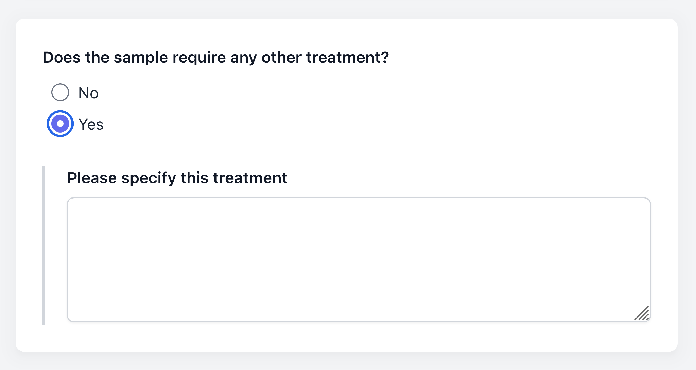
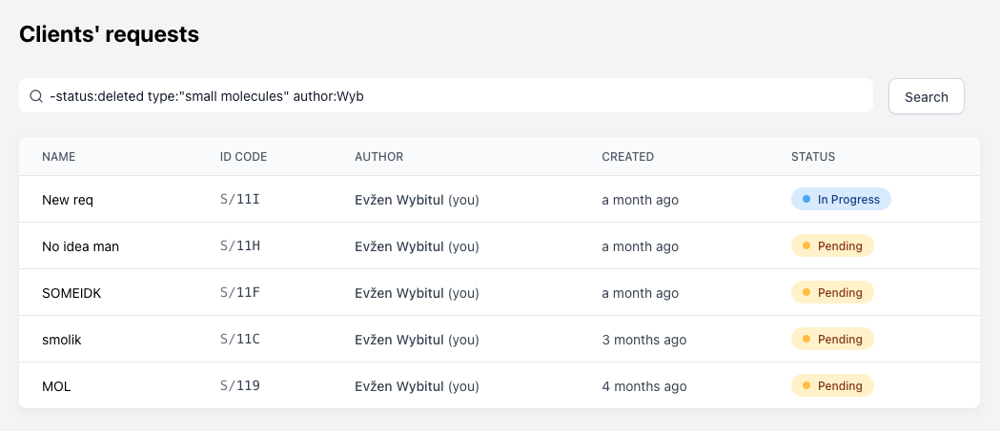
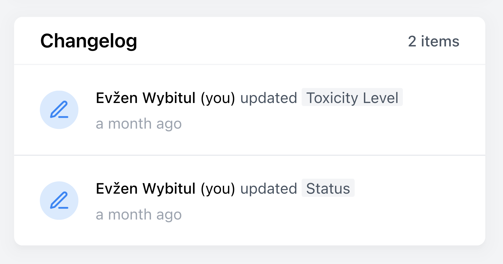

# Request 2 — Request management system for analytical labs

No more tracking requests on paper! Request 2 is a web service that moves the bulk of request specification and request tracking online.

            

## Workflow

At the begining, your analytical lab has to make one or more templates (or _forms_) that specify what information you need from your clients. You only need to do this once.

From then on, the workflow looks like this:

1. A client logs into Request 2 and fills in one of the predefined forms in his web browser.
2. You receive an automatic email notifying you there's a new request wating to be done.
3. You check the request details online, and then do the requested measurement.
4. When you're done, you submit the results on the page of the client's request. He receives an email that the request has been completed.

You can get back to your client anytime and ask for clarification or further details in the comments section on the request's page.

## Form specification

You can specify the forms for your clients with a simple language based on HTML, that is easy to understand even for non-programmers. For example, the following code

```jsx
<SingleChoice
  q="Does the sample require any other treatment?"
  id="Requires Other Treatment"
>
  <Option value="No" />
  <Option value="Yes">
    <LongText q="Please specify this treatment" id="Other Treatment Details" />
  </Option>
</SingleChoice>
```

Produces the following form fields



Most common field types are already supported (text, numbers, single and multiple choice, files). For more details, see the demo form in this repo.


## Request tracking

You can easily filter through your client's requests thanks to our query system.



## Request changelog

Every request is editable, to allow clients to correct errors, or fill in additional details. To help you keep track of the changes, they are logged on the page of the request.


